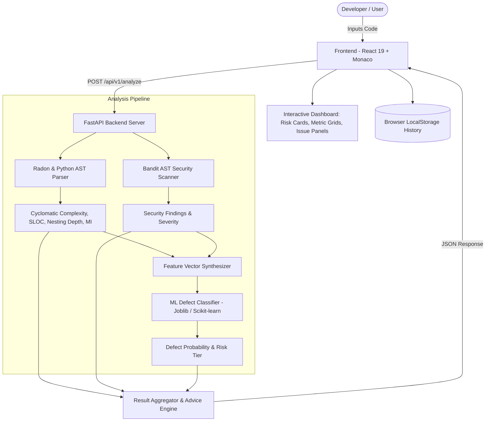

# Code Quality & Defect Risk Analyzer ⚡🔍

[](https://github.com/SaiV-05-18/code-analyser/actions/workflows/deploy.yml)
[](https://fastapi.tiangolo.com)
[](https://react.dev)
[](https://vite.dev)
[](https://tailwindcss.com)
[](https://www.python.org)
[](LICENSE)

A modern, full-stack software intelligence platform that combines **Abstract Syntax Tree (AST) static code analysis** with **Machine Learning defect risk estimation** to assess code health, identify security anti-patterns, calculate complexity metrics, and estimate defect probability in real time.

---

## 🚀 Key Features

- **⚡ Dual-Engine Analysis**:
  - **AST Static Engine**: Computes Cyclomatic Complexity (via Radon CC), Maintainability Index (MI), Halstead effort metrics, Raw SLOC/comments/blank lines, and AST nesting depth.
  - **Security Anti-Pattern Scanner**: Embedded Bandit AST visitor identifies common vulnerabilities, hardcoded secrets, insecure subprocess calls, and unsafe evaluations.
  - **ML Defect Prediction Engine**: Pre-trained ensemble classifier trained on empirical software metrics (NASA MDP / PROMISE corpus distributions) that outputs defect probability percentage and categorized risk tiers (**Low**, **Medium**, **High**).
- **💻 Modern Monaco IDE**:
  - Full-fidelity code editing powered by Monaco Editor (`theme="vs"` light synchronized).
  - Multi-language template switcher (Python, Java, C, C++) with syntax highlighting and auto-indentation.
  - Local file drag-and-drop or file upload reader (`.py`, `.java`, `.c`, `.cpp`).
  - Stale-state indicator notifying developers when code changes invalidate past results.
- **🔄 Session History with 1-Click Re-run**:
  - Automatically records previous scans to local browser storage with timestamps, defect metrics, and snapshot previews.
  - Multi-factor search across filenames and target languages.
  - Defect risk level filtering (Low, Medium, High).
  - **1-Click Snippet Re-run**: Immediately loads any historical snippet back into the Monaco analyzer and triggers real-time re-analysis.
- **🎨 Refined Minimalist Aesthetic**:
  - Inspired by clean, typography-first modern web applications (pure white canvas, subtle borders, black squircle badges, pill buttons).
  - Responsive mobile drawer navigation with quick access to Analyzer, History, and Settings.
  - Zero-friction experience with direct workspace access.
- **🛠️ Automated CI/CD Pipelines**:
  - GitHub Actions workflow deploying production builds automatically to **GitHub Pages**.
  - Integrated Firebase Hosting support with `firebase.json` configuration.

---

## 🏛️ System Architecture



---

## 📁 Repository Structure

```text
code-analyser/
├── .github/
│   └── workflows/
│       ├── deploy.yml                   # GitHub Pages automated build & deployment
│       └── firebase-hosting-deploy.yml  # Firebase Hosting deployment workflow
├── backend/
│   ├── main.py                          # FastAPI server endpoints & CORS configuration
│   ├── requirements.txt                 # Backend Python package dependencies
│   └── venv/                            # (Ignored) Python virtual environment
├── frontend/
│   ├── public/                          # Static assets and favicon
│   ├── src/
│   │   ├── components/
│   │   │   ├── dashboard/               # MetricsGrid, RiskCard, StaticIssues, PredictionResult
│   │   │   ├── editor/                  # Monaco CodeEditor wrapper
│   │   │   └── layout/                  # Minimalist Sidebar, Header, and Layout components
│   │   ├── pages/
│   │   │   ├── Analyze.jsx              # Main analysis workspace & Monaco IDE
│   │   │   ├── History.jsx              # Session history log with 1-click re-runs
│   │   │   ├── Home.jsx                 # Minimalist landing page
│   │   │   └── Settings.jsx             # Analysis engine threshold configurations
│   │   ├── services/
│   │   │   └── analysisService.js       # Client API client for backend communication
│   │   ├── App.jsx                      # Router & layout setup
│   │   ├── index.css                    # Tailwind CSS v4 styling rules
│   │   └── main.jsx                     # Application entry point
│   ├── package.json                     # Frontend scripts & dependencies
│   └── vite.config.js                   # Vite dev server & proxy settings
├── ml/
│   ├── analyzer.py                      # Core AST parser, Radon metrics, Bandit scan & ML inference
│   ├── defect_model.joblib              # Pre-trained Random Forest defect classification model
│   └── train_model.py                   # Script to train/re-train defect model on empirical distributions
├── .firebaserc                          # Firebase project configuration
├── firebase.json                        # Firebase hosting configuration
├── .gitignore                           # Git ignore rules for Python, Node, and build artifacts
└── README.md                            # Project documentation
```

---

## 🛠️ Getting Started

### Prerequisites

- **Python**: `3.10` or higher
- **Node.js**: `20.x` or higher
- **npm**: `10.x` or higher

---

### 1. Backend Setup

1. **Navigate to the project root and create a virtual environment**:
   ```bash
   python3 -m venv venv
   source venv/bin/activate    # On Windows: venv\Scripts\activate
   ```

2. **Install backend dependencies**:
   ```bash
   pip install -r backend/requirements.txt
   ```

3. **Start the FastAPI backend server**:
   ```bash
   uvicorn backend.main:app --reload --port 8000
   ```
   The backend API will be available at `http://127.0.0.1:8000`. You can explore the interactive OpenAPI documentation at `http://127.0.0.1:8000/docs`.

---

### 2. Frontend Setup

1. **Open a new terminal and navigate to the `frontend/` directory**:
   ```bash
   cd frontend
   ```

2. **Install frontend dependencies**:
   ```bash
   npm install
   ```

3. **Start the Vite development server**:
   ```bash
   npm run dev
   ```
   Open your browser and navigate to `http://localhost:5173`. The Vite dev server automatically proxies requests made to `/api/*` to the FastAPI backend at `http://127.0.0.1:8000`.

---

### 3. (Optional) Re-training the Defect Risk Model

The repository includes a pre-trained model serialized at `ml/defect_model.joblib`. If you wish to retrain or adjust model hyperparameters:

```bash
python ml/train_model.py
```

This will fit a new `RandomForestClassifier` on software metric vectors (LOC, Cyclomatic Complexity, Maintainability Index, Branch Count, Max Nesting Depth, Security Issues Count) and output classification performance metrics (ROC-AUC, Precision, Recall).

---

## 📡 API Reference

### Health Check

- **Method**: `GET /`
- **Response**:
  ```json
  {
    "status": "healthy",
    "message": "Code Analyzer API is running",
    "docs_url": "/docs"
  }
  ```

---

### Code Analysis

- **Method**: `POST /api/v1/analyze`
- **Request Body**:
  ```json
  {
    "code": "def divide(a, b):\n    if b == 0:\n        return None\n    return a / b",
    "language": "Python"
  }
  ```

- **Response Body**:
  ```json
  {
    "timestamp": "2026-10-03T17:20:00Z",
    "prediction": {
      "risk": "Low",
      "probability": 14.2,
      "confidence": "High"
    },
    "metrics": {
      "loc": 4,
      "sloc": 4,
      "comments": 0,
      "blankLines": 0,
      "cyclomaticComplexity": 2,
      "complexityRank": "A",
      "maintainabilityIndex": 88.5,
      "maintainabilityGrade": "A",
      "nestingDepth": 2,
      "branchCount": 1
    },
    "staticIssues": [],
    "recommendations": [
      {
        "type": "info",
        "message": "Code complexity is within recommended thresholds (CC <= 5)."
      }
    ]
  }
  ```

---

## 🚢 Deployment

### GitHub Pages (Continuous Deployment)

The repository is equipped with a GitHub Actions workflow in `.github/workflows/deploy.yml`. When changes are pushed to the `main` branch, the workflow:
1. Checks out the code.
2. Installs Node.js dependencies in `frontend/`.
3. Runs `npm run build` to generate optimized production assets in `frontend/dist`.
4. Uploads and deploys the build artifact to **GitHub Pages**.

To enable this on your own fork:
1. Go to repository **Settings** -> **Pages**.
2. Under **Build and deployment** -> **Source**, select **GitHub Actions**.

### Firebase Hosting

To deploy the frontend to Firebase Hosting:
```bash
npm --prefix frontend run build
firebase deploy --only hosting
```

---

## 🧪 Testing & Code Quality

Run Oxlint to check JavaScript/React code quality:
```bash
npm --prefix frontend run lint
```

Build the production frontend bundle to verify typing and asset minification:
```bash
npm --prefix frontend run build
```

Verify backend Python syntax:
```bash
python3 -m py_compile backend/main.py ml/analyzer.py ml/train_model.py
```

---

## 📄 License

This project is licensed under the [MIT License](LICENSE).
